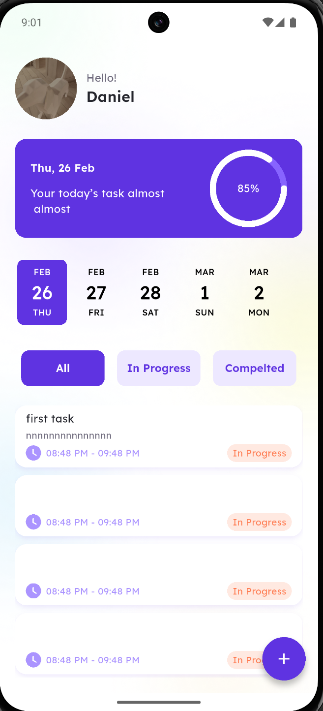
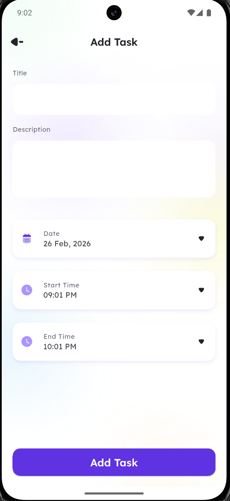

# 📱 Taskati – Task Scheduling App

## Preview  
Here’s a quick look at the app interface:

| Splash Screen | Complete Profile | Home | Add Task |
|---------------|------------------|------|----------|
|  |  |  |  |

---

## 📝 Description  
**Taskati** is a modern task scheduling app built with **Flutter**. It helps users stay organized by providing a clean UI, profile customization, and smooth navigation. The app is designed with **scalable widgets**, **state management**, and **modular components** to ensure a professional and polished experience.

---

## ✨ Features  

- **Splash Screen**  
  - Animated intro using **Lottie**.  
  - Smooth transition to profile setup after a short delay.  

- **Complete Profile Setup**  
  - Upload profile image from **camera** or **gallery**.  
  - Delete or replace profile image easily.  
  - Enter and validate user name with custom form fields.  
  - Error handling with **custom snack bars** for missing inputs.  
  - **SharedPreferences integration** to persist user photo and name across sessions.  

- **Home Page**  
  - Personalized greeting with stored user name and photo.  
  - Daily progress indicator with percentage completion.  
  - Horizontal date picker for weekly navigation.  
  - Task filters: **All**, **In Progress**, **Completed**.  
  - Task list with status labels and time ranges.  
  - Floating action button to add new tasks.  

- **Add Task Page**  
  - Create new tasks with **title**, **description**, **date**, and **time range**.  
  - Tasks are cached locally using **Hive** for persistence.  
  - Unique task IDs ensure no overwriting of existing tasks.  
  - Reactive task list updates instantly when new tasks are added.  

- **Custom Widgets**  
  - `MainButton`, `SecondaryButton`, and `FilledIconButton` for consistent UI.  
  - `ImageContainer` for profile image display.  
  - `CustomFormField` for reusable input fields.  

- **Navigation**  
  - Seamless page transitions using `pushReplacement`.  

- **UI/UX**  
  - Elegant typography with `TextStyles`.  
  - Consistent color palette from `AppColors`.  
  - Responsive spacing using `Gap`.  