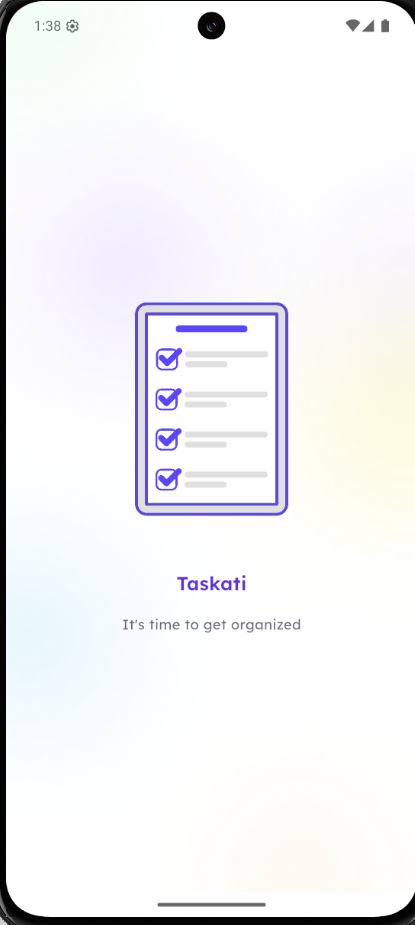
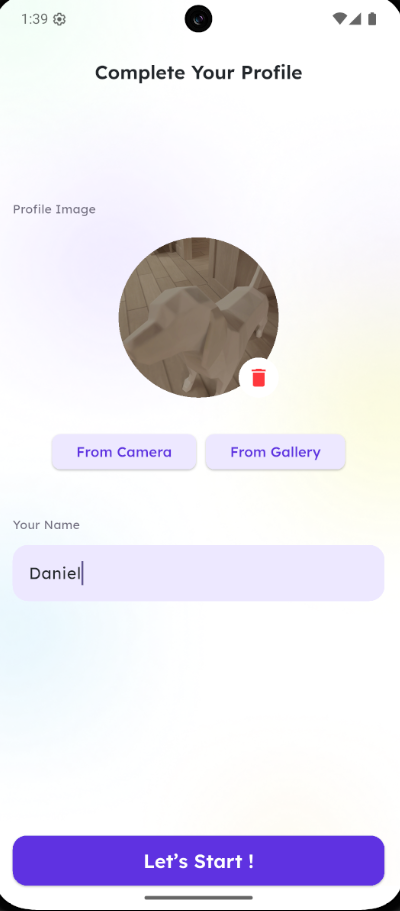
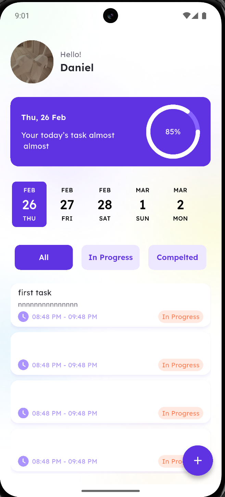
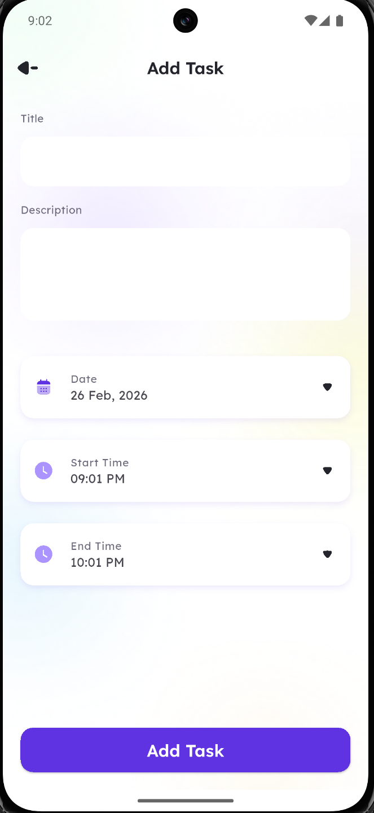
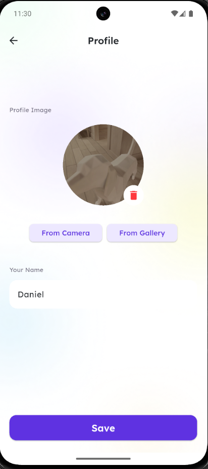
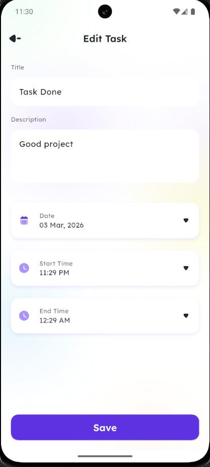
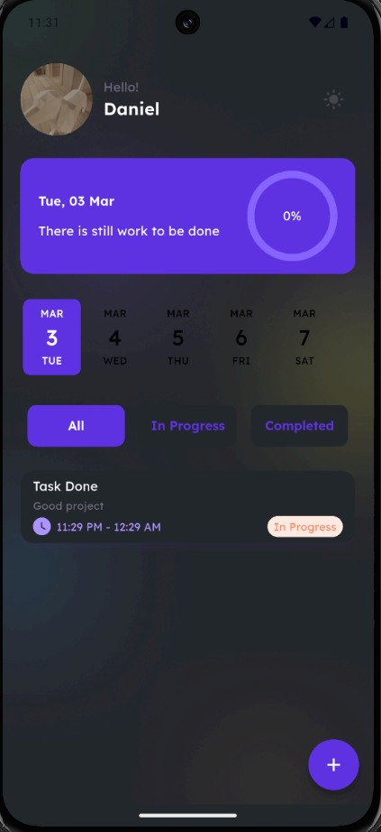
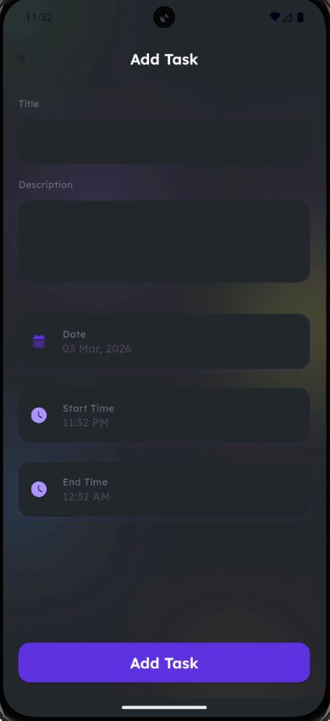

# 📱 Taskati – Task Scheduling App  

## Preview  

| Splash Screen | Complete Profile | Home | Add Task | Edit Profile | Edit Task |  
|---------------|------------------|------|----------|--------------|-----------|  
|  |  |  |  |  |  |  

**Dark Theme Preview**  

| Home (Dark) | Add Task (Dark) |  
|-------------|-----------------|  
|  |  |  

---

## 📝 Description  
**Taskati** is a modern task scheduling app built with **Flutter**. It helps users stay organized by providing a clean UI, profile customization, and smooth navigation. The app is designed with **scalable widgets**, **state management**, and **modular components** to ensure a professional and polished experience.  

Now, Taskati goes further:  
- You can **edit tasks after adding them**, update details, or adjust time ranges.  
- Tasks can be **marked as completed** or **deleted**.  
- The **daily progress bar** now corresponds to the actual progress of the current day.  
- A full **dark theme** is available for a seamless experience in low-light environments.  

---

## ✨ Features  

- **Splash Screen**  
  - Animated intro using **Lottie**.  
  - Smooth transition to profile setup after a short delay.  

- **Complete Profile Setup**  
  - Upload profile image from **camera** or **gallery**.  
  - Delete or replace profile image easily.  
  - Enter and validate user name with custom form fields.  
  - Error handling with **custom snack bars** for missing inputs.  
  - **SharedPreferences integration** to persist user photo and name across sessions.  

- **Home Page**  
  - Personalized greeting with stored user name and photo.  
  - Daily progress indicator now reflects **actual task completion**.  
  - Horizontal date picker for weekly navigation.  
  - Task filters: **All**, **In Progress**, **Completed**.  
  - Task list with status labels and time ranges.  
  - Floating action button to add new tasks.  
  - **Dark theme support** for better accessibility.  

- **Add & Edit Task Page**  
  - Create new tasks with **title**, **description**, **date**, and **time range**.  
  - Edit existing tasks to update details.  
  - Tasks can be marked as **completed** or **deleted**.  
  - Tasks are cached locally using **Hive** for persistence.  
  - Unique task IDs ensure no overwriting of existing tasks.  
  - Reactive task list updates instantly when tasks are added, edited, or deleted.  

- **Custom Widgets**  
  - `MainButton`, `SecondaryButton`, and `FilledIconButton` for consistent UI.  
  - `ImageContainer` for profile image display.  
  - `CustomFormField` for reusable input fields.  

- **Navigation**  
  - Seamless page transitions using `pushReplacement`.  

- **UI/UX**  
  - Elegant typography with `TextStyles`.  
  - Consistent color palette from `AppColors`.  
  - Responsive spacing using `Gap`.  
  - **Dark theme integration** for modern design.  